# Итоговое домашнее задание по 3-му модулю

## Тема
Анализ киберугроз с использованием VirusTotal API и анализ уязвимостей программного обеспечения через Vulners API

---

## Цели задания
- Разработать на Python инструмент для анализа файлов на наличие вирусов и других киберугроз с использованием API VirusTotal.
- Разработать инструмент анализа уязвимостей программного обеспечения на основе CVE через Vulners API.
- Автоматизировать процессы распаковки архива, отправки файлов на анализ и получения отчетов.
- Представить результаты работы скриптов в виде JSON-отчета и консольного вывода.

---

## Инструменты
- **Python 3.x**
- **API VirusTotal**  
  [https://www.virustotal.com/gui/my-apikey](https://www.virustotal.com/gui/my-apikey)
- **API Vulners**  
  [https://vulners.com/docs/api/](https://vulners.com/docs/api/)
- Библиотеки: `requests`, `zipfile`, `python-dotenv`, `json`
- Операционная система: Windows / Linux

---

## Часть 1: Анализ киберугроз через VirusTotal API

### Описание работы скрипта
1. **Распаковка архива**  
   Скрипт извлекает файлы из ZIP-архива (с паролем или без) с помощью модуля `zipfile`.

2. **Отправка файлов на анализ**  
   Файлы отправляются в VirusTotal через HTTP POST-запросы. Возвращается уникальный Scan ID для каждого файла.

3. **Получение отчетов**  
   Скрипт по Scan ID запрашивает детализированные отчеты: количество обнаружений (malicious, suspicious, harmless), список антивирусов, которые сработали, и данные из Sandbox (если доступны).

4. **Формирование JSON-отчета**  
   Собранные результаты агрегируются в отчет `scan_report.json`.

### Пример структуры итогового JSON-отчета
```json
{
  "scans": [
    {
      "scan_id": "NjEyYjU3ZTJhZmU3MDY1ZWJlOTIxMzM3MTcwZGY3ZDQ6MTc0MjMyNTM1Ng==",
      "statistics": {
        "malicious": 26,
        "suspicious": 0,
        "harmless": 0
      },
      "antivirus": {
        "detected": [
          "Kingsoft", "ESET-NOD32", "Varist", "ALYac", "ClamAV",
          "Sangfor", "Ikarus", "CTX", "alibabacloud", "Microsoft",
          "Lionic", "Symantec", "Avast", "Fortinet", "ViRobot",
          "Arcabit", "DrWeb", "AVG", "Google", "GData",
          "MicroWorld-eScan", "BitDefender", "Emsisoft", "FireEye", "Kaspersky", "VIPRE"
        ],
        "whitelist_hits": ["Fortinet"],
        "whitelist_misses": ["Sophos", "McAfee", "Yandex"]
      },
      "sandbox": []
    }
  ]
}
```

## 📊 Пример результата из VirusTotal

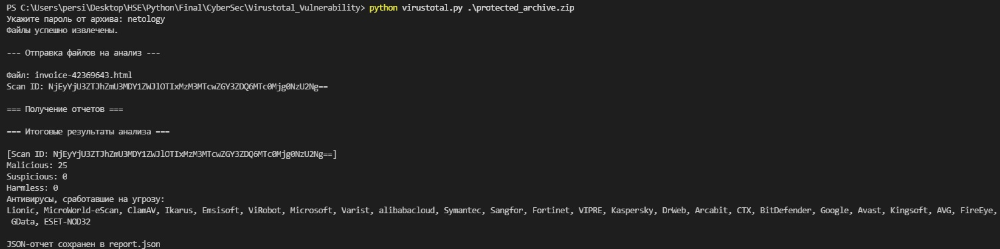
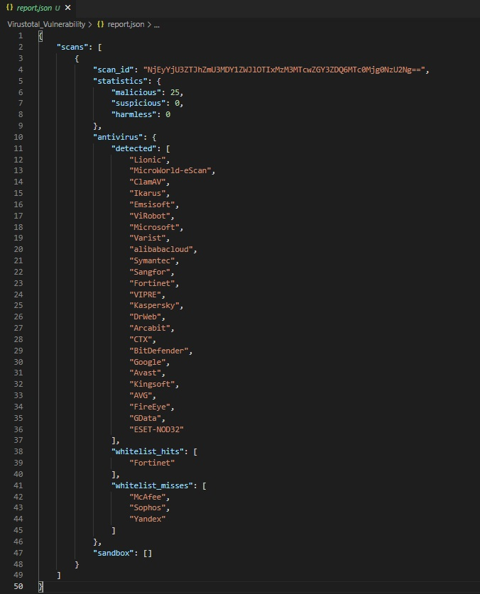


---

## Часть 2: Анализ уязвимостей ПО через Vulners API

### Описание работы скрипта
1. **Чтение списка программ из JSON**  
   Программы и их версии для анализа берутся из файла `software_list.json`.

2. **Запрос к Vulners API**  
   Для каждой пары (программа, версия) отправляется запрос к API, где осуществляется поиск уязвимостей по ключевым словам.

3. **Анализ результатов**  
   Извлекаются все найденные CVE. Если присутствует признак `is_exploit` или поле `type` содержит `exploit`, то CVE считается эксплуатируемым.

4. **Формирование отчетов**  
   Скрипт формирует:
   - Читаемый текстовый отчет `vuln_results.txt`
   - Структурированный JSON-отчет `vulnerability_summary.json`

### Пример содержимого `software_list.json`
```json
[
  { "Program": "LibreOffice", "Version": "6.0.7" },
  { "Program": "7zip", "Version": "18.05" },
  { "Program": "Adobe Reader", "Version": "2018.011.20035" },
  { "Program": "nginx", "Version": "1.14.0" },
  { "Program": "Apache HTTP Server", "Version": "2.4.29" },
  { "Program": "DjVu Reader", "Version": "2.0.0.27" },
  { "Program": "Wireshark", "Version": "2.6.1" },
  { "Program": "Notepad++", "Version": "7.5.6" },
  { "Program": "Google Chrome", "Version": "68.0.3440.106" },
  { "Program": "Mozilla Firefox", "Version": "61.0.1" }
]
```

### Пример структуры `vulnerability_summary.json`
```json
[
    {
        "program": "LibreOffice",
        "version": "6.0.7",
        "vulnerable": true,
        "cve_list": [
            "CVE-2019-9850",
            "CVE-2019-9851",
            "CVE-2019-9852",
            "CVE-2019-9848",
            "CVE-2019-9849",
            "CVE-2018-16858",
            "CVE-2020-12801",
            "CVE-2020-12803",
            "CVE-2022-26305",
            "CVE-2022-26306",
            "CVE-2022-26307",
            "CVE-2022-3140",
            "CVE-2022-38745",
            "CVE-2019-9854",
            "CVE-2021-25636",
            "CVE-2017-12607",
            "CVE-2017-12608",
            "CVE-2017-7870",
            "CVE-2017-8358",
            "CVE-2018-10119",
            "CVE-2018-10120",
            "CVE-2018-10583",
            "CVE-2019-9853",
            "CVE-2020-12802",
            "CVE-2021-25633",
            "CVE-2021-25634",
            "CVE-2021-25635",
            "CVE-2023-0950",
            "CVE-2023-1183",
            "CVE-2023-2255",
            "CVE-2023-6185",
            "CVE-2023-6186"
        ],
        "exploits_available": [
            "CVE-2018-16858"
        ]
    },
    {
        "program": "7zip",
        "version": "18.05",
        "vulnerable": true,
        "cve_list": [
            "CVE-2018-10115"
        ],
        "exploits_available": []
    },
    {
        "program": "Adobe Reader",
        "version": "2018.011.20035",
        "vulnerable": true,
        "cve_list": [
            "CVE-2018-4872",
            "CVE-2018-4879",
            "CVE-2018-4880",
            "CVE-2018-4881",
            "CVE-2018-4882",
            "CVE-2018-4883",
            "CVE-2018-4884",
            "CVE-2018-4885",
            "CVE-2018-4886",
            "CVE-2018-4887",
            "CVE-2018-4888",
            "CVE-2018-4889",
            "CVE-2018-4890",
            "CVE-2018-4891",
            "CVE-2018-4892",
            "CVE-2018-4893",
            "CVE-2018-4894",
            "CVE-2018-4895",
            "CVE-2018-4896",
            "CVE-2018-4897",
            "CVE-2018-4898",
            "CVE-2018-4899",
            "CVE-2018-4900",
            "CVE-2018-4901",
            "CVE-2018-4902",
            "CVE-2018-4903",
            "CVE-2018-4904",
            "CVE-2018-4905",
            "CVE-2018-4906",
            "CVE-2018-4907",
            "CVE-2018-4908",
            "CVE-2018-4909",
            "CVE-2018-4910",
            "CVE-2018-4911",
            "CVE-2018-4912",
            "CVE-2018-4913",
            "CVE-2018-4914",
            "CVE-2018-4915",
            "CVE-2018-4916",
            "CVE-2018-4917",
            "CVE-2018-4918",
            "CVE-2018-4997",
            "CVE-2018-4998",
            "CVE-2018-4999"
        ],
        "exploits_available": []
    },
    {
        "program": "nginx",
        "version": "1.14.0",
        "vulnerable": true,
        "cve_list": [
            "CVE-2024-10102",
            "CVE-2024-10151",
            "CVE-2024-10356",
            "CVE-2024-10453",
            "CVE-2024-10548",
            "CVE-2024-10562",
            "CVE-2024-10584",
            "CVE-2024-10797",
            "CVE-2024-10815",
            "CVE-2024-10856",
            "CVE-2024-10862",
            "CVE-2024-10932",
            "CVE-2024-10957",
            "CVE-2024-11196",
            "CVE-2024-11230",
            "CVE-2024-11254",
            "CVE-2024-11267",
            "CVE-2024-11280",
            "CVE-2024-11281",
            "CVE-2024-11287",
            "CVE-2024-11291",
            "CVE-2024-11294",
            "CVE-2024-11295",
            "CVE-2024-11297",
            "CVE-2024-11331",
            "CVE-2024-11349",
            "CVE-2024-11350",
            "CVE-2024-11356",
            "CVE-2024-11357",
            "CVE-2024-11411",
            "CVE-2024-11439",
            "CVE-2024-11606",
            "CVE-2024-11636",
            "CVE-2024-11682",
            "CVE-2024-11688",
            "CVE-2024-11722",
            "CVE-2024-11726",
            "CVE-2024-11733",
            "CVE-2024-11740",
            "CVE-2024-11748",
            "CVE-2024-11768",
            "CVE-2024-11774",
            "CVE-2024-11775",
            "CVE-2024-11776",
            "CVE-2024-11783",
            "CVE-2024-11784",
            "CVE-2024-11806",
            "CVE-2024-11808",
            "CVE-2024-11811",
            "CVE-2024-11812",
            "CVE-2024-11849",
            "CVE-2024-11852",
            "CVE-2024-11878",
            "CVE-2024-11881",
            "CVE-2024-11885",
            "CVE-2024-11893",
            "CVE-2024-11896",
            "CVE-2024-11900",
            "CVE-2024-11902",
            "CVE-2024-11905",
            "CVE-2024-11906",
            "CVE-2024-11912",
            "CVE-2024-11926",
            "CVE-2024-11930",
            "CVE-2024-11938",
            "CVE-2024-11974",
            "CVE-2024-11975",
            "CVE-2024-11977",
            "CVE-2024-12024",
            "CVE-2024-12025",
            "CVE-2024-12031",
            "CVE-2024-12032",
            "CVE-2024-12034",
            "CVE-2024-12047",
            "CVE-2024-12061",
            "CVE-2024-12066",
            "CVE-2024-12100",
            "CVE-2024-12103",
            "CVE-2024-12121",
            "CVE-2024-12127",
            "CVE-2024-12132",
            "CVE-2024-12190",
            "CVE-2024-12195",
            "CVE-2024-12210",
            "CVE-2024-12219",
            "CVE-2024-12220",
            "CVE-2024-12221",
            "CVE-2024-12237",
            "CVE-2024-12238",
            "CVE-2024-12239",
            "CVE-2024-12250",
            "CVE-2024-12259",
            "CVE-2024-12262",
            "CVE-2024-12266",
            "CVE-2024-12268",
            "CVE-2024-12272",
            "CVE-2024-12274",
            "CVE-2024-12279",
            "CVE-2024-12287",
            "CVE-2024-12293",
            "CVE-2024-12301",
            "CVE-2024-12302",
            "CVE-2024-12311",
            "CVE-2024-12331",
            "CVE-2024-12335",
            "CVE-2024-12340",
            "CVE-2024-12395",
            "CVE-2024-12405",
            "CVE-2024-12408",
            "CVE-2024-12413",
            "CVE-2024-12428",
            "CVE-2024-12432",
            "CVE-2024-12443",
            "CVE-2024-12449",
            "CVE-2024-12454",
            "CVE-2024-12468",
            "CVE-2024-12469",
            "CVE-2024-12475",
            "CVE-2024-12500",
            "CVE-2024-12506",
            "CVE-2024-12507",
            "CVE-2024-12509",
            "CVE-2024-12513",
            "CVE-2024-12518",
            "CVE-2024-12545",
            "CVE-2024-12554",
            "CVE-2024-12558",
            "CVE-2024-12560",
            "CVE-2024-12566",
            "CVE-2024-12567",
            "CVE-2024-12568",
            "CVE-2024-12571",
            "CVE-2024-12583",
            "CVE-2024-12585",
            "CVE-2024-12587",
            "CVE-2024-12588",
            "CVE-2024-12591",
            "CVE-2024-12594",
            "CVE-2024-12596",
            "CVE-2024-12601",
            "CVE-2024-12617",
            "CVE-2024-12622",
            "CVE-2024-12626",
            "CVE-2024-12635",
            "CVE-2024-12636",
            "CVE-2024-12697",
            "CVE-2024-12701",
            "CVE-2024-12710",
            "CVE-2024-12714",
            "CVE-2024-12715",
            "CVE-2024-12717",
            "CVE-2024-12721",
            "CVE-2024-12731",
            "CVE-2024-12736",
            "CVE-2024-12771",
            "CVE-2024-12814",
            "CVE-2024-12850",
            "CVE-2024-12874",
            "CVE-2024-12875",
            "CVE-2024-12881",
            "CVE-2024-43243",
            "CVE-2024-49222",
            "CVE-2024-49300",
            "CVE-2024-49303",
            "CVE-2024-49333",
            "CVE-2024-49644",
            "CVE-2024-49655",
            "CVE-2024-49666",
            "CVE-2024-49688",
            "CVE-2024-49699",
            "CVE-2024-49700",
            "CVE-2024-51646",
            "CVE-2024-51700",
            "CVE-2024-51818",
            "CVE-2024-51919",
            "CVE-2024-52485",
            "CVE-2024-54222",
            "CVE-2024-54346",
            "CVE-2024-56014",
            "CVE-2024-56015",
            "CVE-2024-56016",
            "CVE-2024-56018",
            "CVE-2024-56019",
            "CVE-2024-56020",
            "CVE-2024-56021",
            "CVE-2024-56022",
            "CVE-2024-56023",
            "CVE-2024-56024",
            "CVE-2024-56025",
            "CVE-2024-56026",
            "CVE-2024-56027",
            "CVE-2024-56028",
            "CVE-2024-56029",
            "CVE-2024-56030",
            "CVE-2024-56031",
            "CVE-2024-56032",
            "CVE-2024-56033",
            "CVE-2024-56034",
            "CVE-2024-56035",
            "CVE-2024-56036",
            "CVE-2024-56037",
            "CVE-2024-56038",
            "CVE-2024-56039",
            "CVE-2024-56040",
            "CVE-2024-56041",
            "CVE-2024-56042",
            "CVE-2024-56043",
            "CVE-2024-56044",
            "CVE-2024-56045",
            "CVE-2024-56046",
            "CVE-2024-56047",
            "CVE-2024-56048",
            "CVE-2024-56049",
            "CVE-2024-56050",
            "CVE-2024-56051",
            "CVE-2024-56052",
            "CVE-2024-56053",
            "CVE-2024-56054",
            "CVE-2024-56055",
            "CVE-2024-56056",
            "CVE-2024-56057",
            "CVE-2024-56058",
            "CVE-2024-56059",
            "CVE-2024-56060",
            "CVE-2024-56061",
            "CVE-2024-56062",
            "CVE-2024-56063",
            "CVE-2024-56064",
            "CVE-2024-56065",
            "CVE-2024-56067",
            "CVE-2024-56068",
            "CVE-2024-56069",
            "CVE-2024-56070",
            "CVE-2024-56071",
            "CVE-2024-56203",
            "CVE-2024-56204",
            "CVE-2024-56205",
            "CVE-2024-56206",
            "CVE-2024-56207",
            "CVE-2024-56208",
            "CVE-2024-56209",
            "CVE-2024-56210",
            "CVE-2024-56211",
            "CVE-2024-56212",
            "CVE-2024-56213",
            "CVE-2024-56214",
            "CVE-2024-56215",
            "CVE-2024-56216",
            "CVE-2024-56217",
            "CVE-2024-56218",
            "CVE-2024-56219",
            "CVE-2024-56220",
            "CVE-2024-56221",
            "CVE-2024-56222",
            "CVE-2024-56223",
            "CVE-2024-56224",
            "CVE-2024-56225",
            "CVE-2024-56226",
            "CVE-2024-56227",
            "CVE-2024-56228",
            "CVE-2024-56229",
            "CVE-2024-56230",
            "CVE-2024-56231",
            "CVE-2024-56232",
            "CVE-2024-56233",
            "CVE-2024-56234",
            "CVE-2024-56235",
            "CVE-2024-56236",
            "CVE-2024-56237",
            "CVE-2024-56238",
            "CVE-2024-56239",
            "CVE-2024-56240",
            "CVE-2024-56241",
            "CVE-2024-56242",
            "CVE-2024-56243",
            "CVE-2024-56244",
            "CVE-2024-56245",
            "CVE-2024-56246",
            "CVE-2024-56247",
            "CVE-2024-56248",
            "CVE-2024-56249",
            "CVE-2024-56250",
            "CVE-2024-56251",
            "CVE-2024-56252",
            "CVE-2024-56253",
            "CVE-2024-56254",
            "CVE-2024-56255",
            "CVE-2024-56256",
            "CVE-2024-56257",
            "CVE-2024-56258",
            "CVE-2024-56259",
            "CVE-2024-56260",
            "CVE-2024-56261",
            "CVE-2024-56262",
            "CVE-2024-56263",
            "CVE-2024-56264",
            "CVE-2024-56265",
            "CVE-2024-56266",
            "CVE-2024-56267",
            "CVE-2024-56268",
            "CVE-2024-56270",
            "CVE-2024-56271",
            "CVE-2024-56272",
            "CVE-2024-56273",
            "CVE-2024-56274",
            "CVE-2024-56275",
            "CVE-2024-56276",
            "CVE-2024-56277",
            "CVE-2024-56278",
            "CVE-2024-56279",
            "CVE-2024-56280",
            "CVE-2024-56281",
            "CVE-2024-56282",
            "CVE-2024-56283",
            "CVE-2024-56284",
            "CVE-2024-56285",
            "CVE-2024-56286",
            "CVE-2024-56287",
            "CVE-2024-56288",
            "CVE-2024-56289",
            "CVE-2024-56290",
            "CVE-2024-56291",
            "CVE-2024-56292",
            "CVE-2024-56293",
            "CVE-2024-56294",
            "CVE-2024-56295",
            "CVE-2024-56296",
            "CVE-2024-56297",
            "CVE-2024-56298",
            "CVE-2024-56299",
            "CVE-2024-56300",
            "CVE-2024-56301",
            "CVE-2024-56302",
            "CVE-2024-8326",
            "CVE-2024-8721",
            "CVE-2024-8855",
            "CVE-2024-8857",
            "CVE-2024-9020",
            "CVE-2024-9503",
            "CVE-2024-9545",
            "CVE-2024-9619",
            "CVE-2024-9624",
            "CVE-2024-9638",
            "CVE-2024-9654",
            "CVE-2025-22311",
            "CVE-2025-22317",
            "CVE-2025-22318",
            "CVE-2025-22319",
            "CVE-2025-22320",
            "CVE-2025-22321",
            "CVE-2025-22322",
            "CVE-2025-22323",
            "CVE-2025-22324",
            "CVE-2025-22325",
            "CVE-2025-22326",
            "CVE-2025-22327",
            "CVE-2025-22328",
            "CVE-2025-22329",
            "CVE-2025-22330",
            "CVE-2025-22331",
            "CVE-2025-22332",
            "CVE-2025-22333",
            "CVE-2025-22334",
            "CVE-2025-22335",
            "CVE-2025-22336",
            "CVE-2025-22337",
            "CVE-2025-22338",
            "CVE-2025-22339",
            "CVE-2025-22341",
            "CVE-2025-22342",
            "CVE-2025-22343",
            "CVE-2025-22344",
            "CVE-2025-22345",
            "CVE-2025-22346",
            "CVE-2025-22347",
            "CVE-2025-22348",
            "CVE-2025-22349",
            "CVE-2025-22350",
            "CVE-2025-22351",
            "CVE-2025-22352",
            "CVE-2025-22353",
            "CVE-2025-22354",
            "CVE-2025-22355",
            "CVE-2025-22357",
            "CVE-2025-22358",
            "CVE-2025-22359",
            "CVE-2025-22361",
            "CVE-2025-22362",
            "CVE-2025-22363",
            "CVE-2025-22364",
            "CVE-2025-22365",
            "CVE-2025-24576",
            "CVE-2025-24584",
            "CVE-2025-24590",
            "CVE-2025-24598",
            "CVE-2025-24606",
            "CVE-2025-24608",
            "CVE-2025-24609",
            "CVE-2025-24617",
            "CVE-2025-24620",
            "CVE-2025-24626",
            "CVE-2025-24628",
            "CVE-2024-45337",
            "CVE-2022-41741",
            "CVE-2022-41742",
            "CVE-2021-23017",
            "CVE-2025-22869",
            "CVE-2025-22868",
            "CVE-2024-24791",
            "CVE-2023-45288",
            "CVE-2024-24784",
            "CVE-2024-0510",
            "CVE-2019-11254",
            "CVE-2019-16276",
            "CVE-2022-31628",
            "CVE-2022-31629",
            "CVE-2022-31630",
            "CVE-2022-31631",
            "CVE-2022-37454",
            "CVE-2020-11724",
            "CVE-2020-36309",
            "CVE-2021-3618",
            "CVE-2020-16845",
            "CVE-2019-11043",
            "CVE-2019-9511",
            "CVE-2019-9513",
            "CVE-2019-9516",
            "CVE-2018-16843",
            "CVE-2018-16844",
            "CVE-2018-16845",
            "CVE-2023-45290",
            "CVE-2024-45341",
            "CVE-2024-45336",
            "CVE-2024-24783",
            "CVE-2024-7347",
            "CVE-2024-24785",
            "CVE-2020-10935",
            "CVE-2024-45338",
            "CVE-2019-20372",
            "CVE-2023-45289",
            "CVE-2021-3449",
            "CVE-2025-22866",
            "CVE-2025-22870",
            "CVE-2020-5505"
        ],
        "exploits_available": [
            "CVE-2021-3449"
        ]
    },
    {
        "program": "Apache HTTP Server",
        "version": "2.4.29",
        "vulnerable": true,
        "cve_list": [
            "CVE-2024-38474",
            "CVE-2024-38475",
            "CVE-2024-38476",
            "CVE-2024-38477",
            "CVE-2017-15710",
            "CVE-2017-15715",
            "CVE-2018-0739",
            "CVE-2018-1000168",
            "CVE-2018-11759",
            "CVE-2018-11763",
            "CVE-2018-1283",
            "CVE-2018-1301",
            "CVE-2018-1302",
            "CVE-2018-1303",
            "CVE-2018-1312",
            "CVE-2018-1333",
            "CVE-2016-2182",
            "CVE-2016-4975",
            "CVE-2016-6302",
            "CVE-2016-6306",
            "CVE-2016-7055",
            "CVE-2017-3731",
            "CVE-2017-3732",
            "CVE-2017-3736",
            "CVE-2017-3737",
            "CVE-2017-3738",
            "CVE-2023-38950",
            "CVE-2023-38951",
            "CVE-2023-38952",
            "CVE-2023-25690",
            "CVE-2023-27522",
            "CVE-2022-26377",
            "CVE-2022-28614",
            "CVE-2022-28615",
            "CVE-2022-29404",
            "CVE-2022-30522",
            "CVE-2022-30556",
            "CVE-2022-31813",
            "CVE-2022-22719",
            "CVE-2022-22720",
            "CVE-2022-22721",
            "CVE-2022-23943",
            "CVE-2021-44224",
            "CVE-2021-44790",
            "CVE-2021-33193",
            "CVE-2021-34798",
            "CVE-2021-36160",
            "CVE-2021-39275",
            "CVE-2021-40438",
            "CVE-2020-13950",
            "CVE-2020-35452",
            "CVE-2021-26690",
            "CVE-2021-26691",
            "CVE-2021-30641",
            "CVE-2020-11984",
            "CVE-2020-11993",
            "CVE-2020-1927",
            "CVE-2020-1934",
            "CVE-2020-9490",
            "CVE-2013-4352",
            "CVE-2013-5704",
            "CVE-2013-6438",
            "CVE-2014-0098",
            "CVE-2014-0117",
            "CVE-2014-0118",
            "CVE-2014-0226",
            "CVE-2014-0231",
            "CVE-2014-3581",
            "CVE-2015-3183",
            "CVE-2015-3185",
            "CVE-2016-0736",
            "CVE-2016-2161",
            "CVE-2016-5387",
            "CVE-2016-8743",
            "CVE-2017-3167",
            "CVE-2017-3169",
            "CVE-2017-7668",
            "CVE-2017-7679",
            "CVE-2017-9788",
            "CVE-2017-9798",
            "CVE-2019-0217",
            "CVE-2020-22001",
            "CVE-2018-0495",
            "CVE-2018-0732",
            "CVE-2018-1000005",
            "CVE-2018-1000007",
            "CVE-2018-1000120",
            "CVE-2018-1000121",
            "CVE-2018-1000122",
            "CVE-2018-14404",
            "CVE-2018-16839",
            "CVE-2018-16840",
            "CVE-2018-16842",
            "CVE-2018-16890",
            "CVE-2019-0211",
            "CVE-2019-3822",
            "CVE-2019-3823",
            "CVE-2019-5436",
            "CVE-2017-10140",
            "CVE-2016-0718",
            "CVE-2016-4483",
            "CVE-2016-5131",
            "CVE-2016-7167",
            "CVE-2016-8615",
            "CVE-2016-8616",
            "CVE-2016-8617",
            "CVE-2016-8618",
            "CVE-2016-8619",
            "CVE-2016-8621",
            "CVE-2016-8622",
            "CVE-2016-8623",
            "CVE-2016-8624",
            "CVE-2016-8625",
            "CVE-2016-9318",
            "CVE-2016-9596",
            "CVE-2016-9597",
            "CVE-2016-9598",
            "CVE-2017-1000254",
            "CVE-2017-1000257",
            "CVE-2017-18258",
            "CVE-2017-6004",
            "CVE-2017-7186",
            "CVE-2017-7244",
            "CVE-2017-7245",
            "CVE-2017-7246",
            "CVE-2017-9047",
            "CVE-2017-9048",
            "CVE-2017-9049",
            "CVE-2017-9050",
            "CVE-2018-0500",
            "CVE-2019-0197",
            "CVE-2019-10081",
            "CVE-2019-10082",
            "CVE-2019-10092",
            "CVE-2019-10097",
            "CVE-2019-10098",
            "CVE-2019-9517",
            "CVE-2006-20001",
            "CVE-2022-36760",
            "CVE-2022-37436",
            "CVE-2018-17189",
            "CVE-2018-17199",
            "CVE-2019-0196",
            "CVE-2019-0220",
            "CVE-2019-9511",
            "CVE-2019-9513",
            "CVE-2019-9516",
            "CVE-2023-38709",
            "CVE-2024-24795",
            "CVE-2024-27316",
            "CVE-2023-31122",
            "CVE-2021-41773",
            "CVE-2021-42013",
            "CVE-2020-11530",
            "CVE-2014-8109",
            "CVE-2018-7543"
        ],
        "exploits_available": [
            "CVE-2018-7543"
        ]
    },
    {
        "program": "DjVu Reader",
        "version": "2.0.0.27",
        "vulnerable": false,
        "cve_list": [],
        "exploits_available": []
    },
    {
        "program": "Wireshark",
        "version": "2.6.1",
        "vulnerable": true,
        "cve_list": [
            "CVE-2008-4640",
            "CVE-2008-3934",
            "CVE-2008-5660",
            "CVE-2008-3933",
            "CVE-2008-4864",
            "CVE-2008-4680",
            "CVE-2008-4681",
            "CVE-2008-4097",
            "CVE-2008-4225",
            "CVE-2009-0022",
            "CVE-2008-4639",
            "CVE-2008-5514",
            "CVE-2008-4552",
            "CVE-2008-4098",
            "CVE-2008-4575",
            "CVE-2008-5285",
            "CVE-2008-3963",
            "CVE-2008-4683",
            "CVE-2008-4314",
            "CVE-2008-2380",
            "CVE-2008-5517",
            "CVE-2008-5006",
            "CVE-2008-4684",
            "CVE-2008-5031",
            "CVE-2008-4641",
            "CVE-2008-5617",
            "CVE-2008-4685",
            "CVE-2008-5618",
            "CVE-2008-4682",
            "CVE-2017-13764",
            "CVE-2017-13765",
            "CVE-2017-13766",
            "CVE-2017-13767",
            "CVE-2017-15189",
            "CVE-2017-15190",
            "CVE-2017-15191",
            "CVE-2017-15192",
            "CVE-2017-15193",
            "CVE-2017-17083",
            "CVE-2017-17084",
            "CVE-2017-17085",
            "CVE-2017-17935",
            "CVE-2017-6014",
            "CVE-2017-9616",
            "CVE-2017-9617",
            "CVE-2017-9766",
            "CVE-2018-11354",
            "CVE-2018-11355",
            "CVE-2018-11356",
            "CVE-2018-11357",
            "CVE-2018-11358",
            "CVE-2018-11359",
            "CVE-2018-11360",
            "CVE-2018-11361",
            "CVE-2018-11362",
            "CVE-2018-5334",
            "CVE-2018-5335",
            "CVE-2018-6836",
            "CVE-2018-7320",
            "CVE-2018-7334",
            "CVE-2018-7335",
            "CVE-2018-7336",
            "CVE-2018-7337",
            "CVE-2018-7417",
            "CVE-2018-7418",
            "CVE-2018-7419",
            "CVE-2018-7420",
            "CVE-2009-1234",
            "CVE-2009-2692",
            "CVE-2009-2414",
            "CVE-2009-0200",
            "CVE-2009-3024",
            "CVE-2009-2416",
            "CVE-2008-4405",
            "CVE-2009-2059",
            "CVE-2009-2730",
            "CVE-2009-2707",
            "CVE-2009-2407",
            "CVE-2009-2070",
            "CVE-2009-2406",
            "CVE-2009-2063",
            "CVE-2009-2067",
            "CVE-2009-0201",
            "CVE-2018-14341",
            "CVE-2019-16319",
            "CVE-2018-18226",
            "CVE-2018-14368",
            "CVE-2018-14342",
            "CVE-2018-14367",
            "CVE-2018-14369",
            "CVE-2018-14370",
            "CVE-2018-18227",
            "CVE-2018-9256",
            "CVE-2018-14340",
            "CVE-2018-14343",
            "CVE-2018-14344",
            "CVE-2018-14339",
            "CVE-2018-16057",
            "CVE-2018-19622",
            "CVE-2018-5336",
            "CVE-2019-10894",
            "CVE-2019-10895",
            "CVE-2019-10899",
            "CVE-2019-10901",
            "CVE-2019-10903",
            "CVE-2015-8712",
            "CVE-2015-8713",
            "CVE-2015-8714",
            "CVE-2015-8716",
            "CVE-2015-8717",
            "CVE-2015-8718",
            "CVE-2015-8719",
            "CVE-2015-8721",
            "CVE-2015-8723",
            "CVE-2015-8729",
            "CVE-2015-8731",
            "CVE-2016-2523",
            "CVE-2016-2530",
            "CVE-2016-2531",
            "CVE-2016-2532",
            "CVE-2016-4006",
            "CVE-2016-4077",
            "CVE-2016-4081",
            "CVE-2016-4085",
            "CVE-2016-5350",
            "CVE-2016-5353",
            "CVE-2016-5359",
            "CVE-2016-6505",
            "CVE-2016-6507",
            "CVE-2016-6508",
            "CVE-2016-6510",
            "CVE-2016-7177",
            "CVE-2016-7179",
            "CVE-2016-7958",
            "CVE-2016-9375",
            "CVE-2017-7703",
            "CVE-2017-9345",
            "CVE-2017-9347",
            "CVE-2017-9349",
            "CVE-2017-9352",
            "CVE-2015-8741",
            "CVE-2016-4082",
            "CVE-2015-8722",
            "CVE-2016-2527",
            "CVE-2016-2524",
            "CVE-2015-8715",
            "CVE-2015-8736",
            "CVE-2015-8726",
            "CVE-2016-2521",
            "CVE-2015-8739",
            "CVE-2015-8724",
            "CVE-2015-8742",
            "CVE-2015-8738",
            "CVE-2016-2529",
            "CVE-2016-2528",
            "CVE-2016-2526",
            "CVE-2015-8737",
            "CVE-2015-8735",
            "CVE-2015-8727",
            "CVE-2015-8728",
            "CVE-2016-2525",
            "CVE-2016-2522",
            "CVE-2015-8732",
            "CVE-2015-8734",
            "CVE-2015-8740",
            "CVE-2020-25863",
            "CVE-2020-25862",
            "CVE-2020-13164",
            "CVE-2020-11647",
            "CVE-2020-9431",
            "CVE-2020-9430",
            "CVE-2020-9428",
            "CVE-2019-19553",
            "CVE-2019-13619",
            "CVE-2019-10896"
        ],
        "exploits_available": []
    },
    {
        "program": "Notepad++",
        "version": "7.5.6",
        "vulnerable": false,
        "cve_list": [],
        "exploits_available": []
    },
    {
        "program": "Google Chrome",
        "version": "68.0.3440.106",
        "vulnerable": true,
        "cve_list": [
            "CVE-2017-4946",
            "CVE-2019-0708",
            "CVE-2019-15637",
            "CVE-2019-7609",
            "CVE-2021-20028",
            "CVE-2021-20038",
            "CVE-2021-3018",
            "CVE-2021-36955",
            "CVE-2021-40684",
            "CVE-2021-41773",
            "CVE-2021-43226",
            "CVE-2021-44142",
            "CVE-2021-44228",
            "CVE-2021-45837",
            "CVE-2022-21882",
            "CVE-2022-22005",
            "CVE-2022-22947",
            "CVE-2022-22965",
            "CVE-2022-24663",
            "CVE-2022-24664",
            "CVE-2022-24665",
            "CVE-2022-24785",
            "CVE-2022-24990",
            "CVE-2022-25064",
            "CVE-2022-27925",
            "CVE-2022-30190",
            "CVE-2022-41352",
            "CVE-2022-47966",
            "CVE-2023-0669",
            "CVE-2023-21932",
            "CVE-2023-25690",
            "CVE-2023-27997",
            "CVE-2023-2868",
            "CVE-2023-28771",
            "CVE-2023-3079",
            "CVE-2023-32315",
            "CVE-2023-32784",
            "CVE-2023-33010",
            "CVE-2023-33246",
            "CVE-2023-34362",
            "CVE-2023-35078",
            "CVE-2023-3519",
            "CVE-2023-42793",
            "CVE-2023-46604",
            "CVE-2018-16065",
            "CVE-2018-16066",
            "CVE-2018-16067",
            "CVE-2018-16068",
            "CVE-2018-16069",
            "CVE-2018-16070",
            "CVE-2018-16071"
        ],
        "exploits_available": []
    },
    {
        "program": "Mozilla Firefox",
        "version": "61.0.1",
        "vulnerable": false,
        "cve_list": [],
        "exploits_available": []
    }
]
```

## 🛡️ Пример анализа уязвимостей (Vulners)

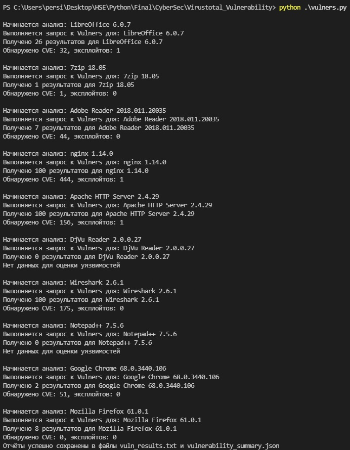

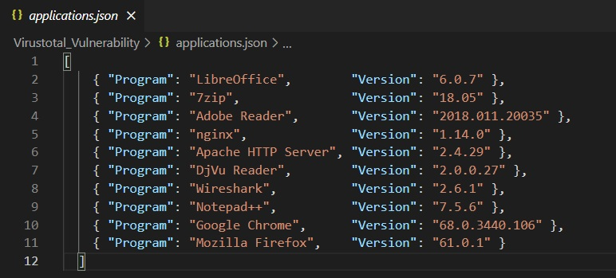
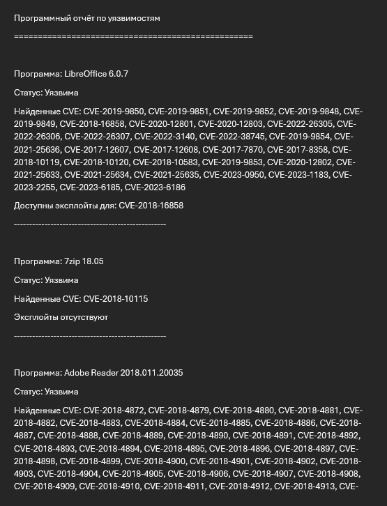
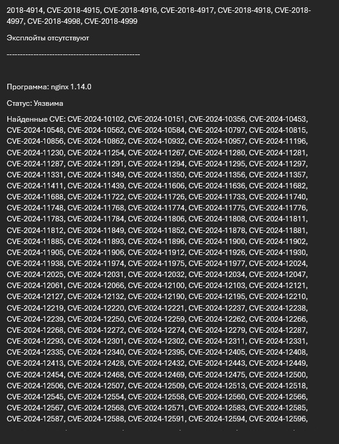
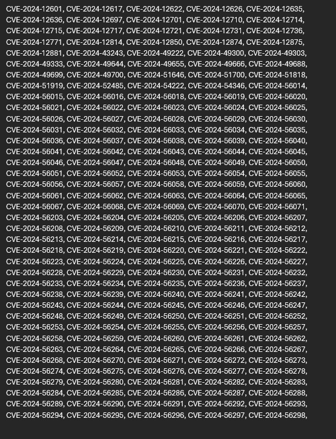
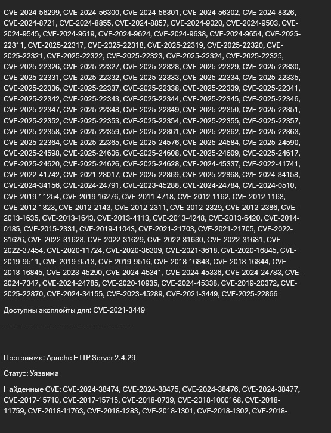
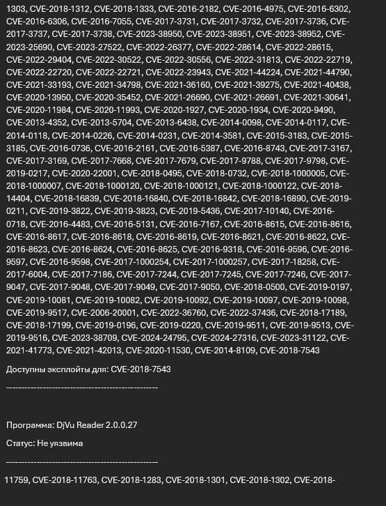
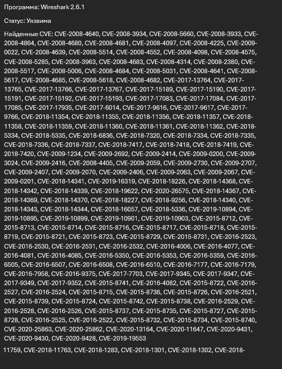
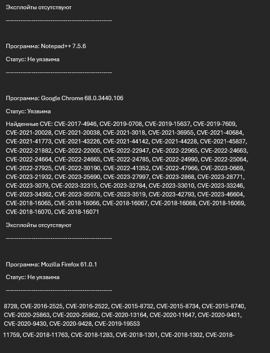

---

## Инструкция по запуску обоих модулей

### VirusTotal:
```bash
pip install requests python-dotenv
```
Создайте файл `.env`:
```
VT_API_KEY=ваш_ключ
```
```bash
python virustotal.py your_archive.zip
```

### Vulners:
```bash
pip install requests python-dotenv
```
Создайте файл `.env`:
```
VULNERS_API=ваш_ключ
```
Убедитесь, что рядом лежит файл `applications.json`. Затем:
```bash
python vulners.py
```

---

## Заключение
В рамках задания были разработаны два Python-инструмента:
- **virustotal.py** — для анализа киберугроз на основе VirusTotal.
- **vulners.py** — для выявления уязвимостей ПО через Vulners API.
